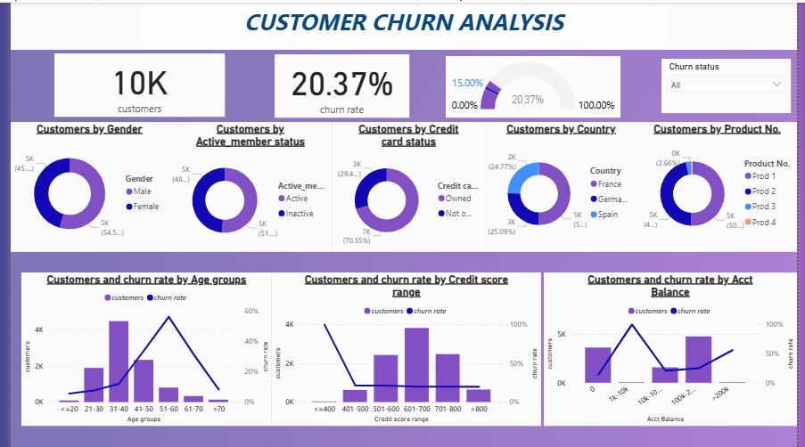

# Customer Churn Analysis – Power BI

## Project Overview

This project analyzes customer churn using Microsoft Power BI.

The objective is to understand customer churn patterns and identify customer characteristics associated with higher churn rates. The dashboard provides an interactive view of customer demographics, activity status, credit information, product usage, and account balance.

## Business Objective

The analysis aims to answer questions such as:

- What is the overall customer churn rate?
- How is the customer base distributed by gender and country?
- How does churn vary across different age groups?
- How does churn vary by credit score?
- Is there a relationship between account balance and churn?
- How do customer activity, credit card ownership, and number of products relate to the customer base?

## Key Performance Indicators

- **Total Customers:** 10K
- **Overall Churn Rate:** 20.37%

## Dashboard Analysis

The dashboard includes analysis of:

- Customers by Gender
- Customers by Active Member Status
- Customers by Credit Card Status
- Customers by Country
- Customers by Product Number
- Customers and Churn Rate by Age Group
- Customers and Churn Rate by Credit Score Range
- Customers and Churn Rate by Account Balance
- Churn Status filter for interactive analysis

## Key Insights

Some key observations from the dashboard include:

- The overall customer churn rate is **20.37%**.
- Customer distribution is analyzed across different countries, genders, and product categories.
- Churn rates vary across different age groups.
- Churn patterns differ across credit score ranges.
- Account balance groups show differences in customer count and churn rate.
- Active membership and credit card status provide additional dimensions for understanding the customer base.

## Tools Used

- **Microsoft Power BI**
- **DAX**
- **Data Visualization**
- **Data Analysis**

## Dashboard Preview

## Project Files

- `Customer churn analysis.pbix` – Power BI dashboard and analysis file
- `customer_churn_dashboard.png` – Dashboard screenshot

## Dataset

The project uses a publicly available Bank Customer Churn / Churn Modelling dataset containing approximately 10,000 customer records.

## Conclusion

This project demonstrates the use of Power BI to analyze customer churn and transform customer data into an interactive business intelligence dashboard.

The analysis can help businesses understand customer behavior and identify patterns associated with customer churn.
